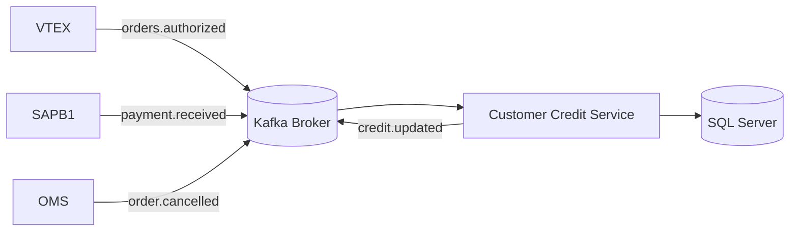

# 🧾 Customer Credit Service (Mimbral OMS)

Microservicio responsable de **gestionar el crédito de clientes** dentro del ecosistema Mimbral OMS, sincronizando información con SAP Business One, el OMS propio y otros microservicios (Orders, Customer, Inventory, etc.) a través de eventos Kafka.

---

## 👈 Descripción general

**Customer Credit Service** mantiene la trazabilidad completa de líneas de crédito, holds temporales, consumos, liberaciones y pagos aplicados a cada cliente.
Su lógica principal se basa en:

* **Persistencia en SQL Server** (`customer_credit_db`)
* **Integración asíncrona vía Kafka**
* **API REST interna** protegida por `x-api-key`
* **Recalculo dinámico** de montos disponibles y en hold
* **Idempotencia** garantizada por tabla `dbo.ProcessedEvents`

---

## ⚙️ Arquitectura



**Topics principales:**

* Entrantes:
  `customer.created`, `customer.updated`,
  `order.authorized`, `order.cancelled`, `order.invoiced`,
  `payment.received`, `customer.credit.upsert`
* Salientes:
  `credit.updated`, `credit.hold.placed`, `credit.hold.released`, `credit.hold.consumed`

---

## 📁 Estructura del proyecto

```
customer-credit/
├── src/
│   ├── config/          # Conexión MSSQL, Kafka y variables de entorno
│   ├── consumers/       # Lectura de eventos Kafka (customers, orders, payments)
│   ├── controllers/     # Lógica HTTP REST
│   ├── middlewares/     # Autenticación e idempotencia
│   ├── models/          # Acceso a tablas SQL
│   ├── producers/       # Emisión de eventos Kafka
│   ├── routes/          # Endpoints REST
│   ├── services/        # Lógica de negocio
│   ├── utils/           # Logger, validaciones
│   └── server.js        # Punto de entrada del servicio
├── .env
├── Dockerfile
└── docker-compose.yml
```

---

## 🚀 Configuración y ejecución

### Requisitos

* Node.js 18+
* SQL Server 2019+
* Apache Kafka (puede usar `wurstmeister/kafka`)
* Docker Desktop (opcional)

### Instalación local

```bash
npm install
npm run dev
```

### Variables de entorno (`.env`)

| Variable          | Descripción                         | Ejemplo                                 |
| ----------------- | ----------------------------------- | --------------------------------------- |
| `PORT`            | Puerto del servicio HTTP            | `5015`                                  |
| `API_KEY`         | API Key interna para endpoints REST | `supersecret`                           |
| `SQL_SERVER_HOST` | Host de SQL Server                  | `host.docker.internal`                  |
| `SQL_SERVER_USER` | Usuario SQL                         | `credit_user`                           |
| `SQL_SERVER_PASS` | Password SQL                        | `Mimbral1579`                           |
| `SQL_SERVER_DB`   | Base de datos                       | `customer_credit_db`                    |
| `KAFKA_BROKER`    | Dirección del broker Kafka          | `kafka:9092`                            |
| `KAFKA_CLIENT_ID` | ID de cliente Kafka                 | `customer-credit`                       |
| `TOPIC_*`         | Topics Kafka entrantes/salientes    | `customer.created`, `credit.updated`... |

---

## 🌐 Endpoints REST

| Método   | Endpoint                    | Descripción                                            |
| -------- | --------------------------- | ------------------------------------------------------ |
| `POST`   | `/credits`                  | Crea o actualiza crédito de cliente (upsert)           |
| `GET`    | `/credits`                  | Lista créditos filtrando por `customerId` o `cardCode` |
| `GET`    | `/credits/:id`              | Obtiene crédito por UUID                               |
| `PATCH`  | `/credits/:id`              | Actualiza campos parciales (`limit`, `notes`, etc.)    |
| `POST`   | `/credits/:id/recalculate`  | Recalcula montos `usedAmount` y `onHoldAmount`         |
| `POST`   | `/credits/:id/holds`        | Crea un hold (reserva de crédito)                      |
| `DELETE` | `/holds/:holdId`            | Libera un hold activo                                  |
| `POST`   | `/holds/:holdId/consume`    | Consume un hold (genera transacción de débito)         |
| `GET`    | `/credits/:id/transactions` | Lista transacciones de crédito                         |
| `POST`   | `/credits/:id/transactions` | Registra una transacción manual o programática         |

**Headers requeridos:**
`x-api-key: supersecret`
`Content-Type: application/json`

---

## 🔄 Eventos Kafka

### **Consumers**

| Topic                    | Propósito                         | Handler                        |
| ------------------------ | --------------------------------- | ------------------------------ |
| `customer.created`       | Alta inicial de crédito           | `handleCustomerCreated()`      |
| `customer.updated`       | Actualización de datos de cliente | `handleCustomerUpdated()`      |
| `customer.credit.upsert` | Sincroniza crédito desde otro MS  | `handleCustomerCreditUpsert()` |
| `order.authorized`       | Bloquea crédito (`placeHold`)     | `OrderConsumer`                |
| `order.cancelled`        | Libera hold                       | `OrderConsumer`                |
| `payment.received`       | Aplica abono y recalcula crédito  | `handlePaymentReceived()`      |

### **Producers**

| Topic                  | Descripción                          | Fuente                 |
| ---------------------- | ------------------------------------ | ---------------------- |
| `credit.updated`       | Emite cada vez que cambia un crédito | `creditEventsProducer` |
| `credit.hold.placed`   | Cuando se bloquea monto por orden    | (futuro)               |
| `credit.hold.released` | Al liberar un hold                   | (futuro)               |
| `credit.hold.consumed` | Al consumir un hold                  | (futuro)               |

---

## 📄 Base de datos SQL

Tablas principales esperadas:

| Tabla                | Propósito                                                 |
| -------------------- | --------------------------------------------------------- |
| `CustomerCredits`    | Registro principal de crédito (limit, used, onHold, etc.) |
| `CreditHolds`        | Holds activos o consumidos vinculados a órdenes           |
| `CreditTransactions` | Movimientos contables de crédito                          |
| `ProcessedEvents`    | Control de idempotencia por `traceId + topic`             |

Procedimientos almacenados requeridos:

* `sp_RecalculateOnHoldAmount`
* `sp_ApplyTransaction`
* `sp_LogCreditEvent`

---

## 🧠 Lógica de negocio clave

### Holds

* Bloqueos creados bajo transacción SERIALIZABLE (`UPDLOCK, ROWLOCK`)
* Valida disponibilidad (`limit - used - onHold`)
* `releaseHold` y `consumeHold` recalculan el crédito tras actualizar estado

### Transacciones

* Cada pago genera una `CreditTransaction` (`type=payment`, `direction=credit`)
* Se recomienda `UNIQUE (creditId, reference)` para idempotencia

### Idempotencia

* Implementada mediante `dbo.ProcessedEvents(traceId, topic)`
* Evita reprocesar mensajes duplicados en Kafka

---

## 🧵 Logging

Se usa **Pino** con niveles automáticos:

```js
import { logger } from '../utils/logger.js';
logger.info({ topic, creditId }, 'Credit updated');
logger.error({ err }, 'Error procesando evento');
```

* Modo desarrollo → `pino-pretty`
* Producción → JSON estructurado

---

## 🛥️ Despliegue con Docker

### docker-compose.yml

```yaml
version: "3.8"
services:
  customer-credit:
    build: .
    container_name: customer-credit
    restart: always
    env_file: .env
    environment:
      NODE_ENV: "production"
      PORT: "5015"
    ports:
      - "5015:5015"
    networks:
      - orders-service_kafka_network
      - default
networks:
  orders-service_kafka_network:
    external: true
  default:
    driver: bridge
```

### Ejecutar

```bash
docker compose up -d --build
```

El servicio quedará disponible en
🔗 `http://localhost:5015/health`

---

## 🧮 Troubleshooting

| Problema                    | Causa probable                      | Solución                                |
| --------------------------- | ----------------------------------- | --------------------------------------- |
| `Kafka no inició`           | Broker no disponible                | Revisar red o variable `KAFKA_BROKER`   |
| `ZodError` en requests      | Cuerpo JSON inválido                | Validar tipos y campos requeridos       |
| `Crédito insuficiente`      | `creditLimit` menor al hold         | Revisar saldos o recalcular manualmente |
| `Cannot find module 'cors'` | Dependencia faltante                | `npm install cors` si agregas CORS      |
| Mensajes duplicados         | Falta registro en `ProcessedEvents` | Revisar índices únicos                  |

---

## 🗾 Licencia

Propietario: **Sociedad Comercial El Mimbral Ltda.**
© 2025 — Todos los derechos reservados.
Desarrollo interno coordinado por **Williams Mejías** (Arquitectura OMS).
