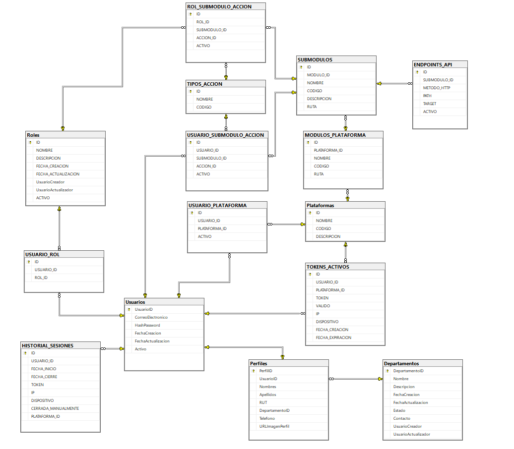

## Descripción General

El **ID-Service** es el microservicio encargado de la **gestión centralizada de identidad, permisos y control de acceso de las plataformas** en el ecosistema de microservicios de Mimbral. Permite administrar usuarios, roles, plataformas, módulos, submódulos y endpoints, asegurando un control robusto basado en autenticación y autorización RBAC.

Este microservicio se integra con el **API Gateway** para validar y enrutar y proteger las solicitudes según los permisos del usuario autenticado.

---

## Tecnologías Utilizadas

- **Node.js**: Entorno de ejecución para JavaScript.
- **Express**: Framework web minimalista para la construcción de APIs REST.
- **Microsoft SQL Server (MSSQL)**: Base de datos relacional para almacenar usuarios, roles y permisos.
- **JWT**: Autenticación basada en tokens.
- **Bcrypt**: Hashing seguro de contraseñas.
- **LRU Cache**: Cacheo de permisos para mejorar el rendimiento en validaciones RBAC.
- **Docker**: Contenerización para despliegue en entornos aislados.
- **Cloudinary**: Base de datos para almacenar las imagenes de los usuarios segun su id.
- **Kafkajs**: Encargado de enviar Topic para que consuman otros microservicios.
---

## Endpoints Principales

### 🔑 Autenticación y Sesiones

- **POST /auth/login** → Iniciar sesión.
- **POST /auth/logout** → Cerrar sesión.
- **POST /auth/renovar** → Renovar sesión.
- **POST /auth/recuperar** → Generar OTP de recuperación.
- **POST /auth/verificar-otp** → Validar OTP.
- **POST /auth/cambiar-contrasena** → Cambiar contraseña con OTP.


### 👥 Usuarios

- **POST /usuarios/crear** → Crear usuario.
- **PUT /usuarios/editar/:id** → Editar usuario.
- **GET /usuarios** → Listar usuarios.

### 🏢 Departamentos

- **POST /departments/post** → Crear departamento.
- **GET /departments/get** → Listar departamentos.
- **PUT /departments/put/:id** → Editar departamento.

### 🖥 Plataformas, Módulos y Endpoints

- **POST /plataformas** → Crear plataforma.
- **GET /plataformas/obtener** → Listar plataformas.
- **PUT /plataformas/editar/:id** → Editar plataforma.
- **POST /modulos-plataforma** → Crear módulo.
- **POST /submodulos** → Crear submódulo.
- **POST /endpoint-api** → Registrar endpoint.

### 🛡 Roles y Permisos

- **POST /create-rol** → Crear rol con permisos.
- **GET /estructura/MIMBRAL_360** → Obtener modulos y permisos
- **GET /role/6** → Obtener permisos de un rol
- **PUT /role/:id** → Actualizar rol.
- **PATCH /users/:id/permissions** → Dar permisos puntuales.
- **GET /users/:id/permissions** → Obtener permisos individuales de un usuario.
- **GET /users/:id/permissions/:idplataforma** → Obtener permisos de acuerdo a usuario y plataforma
- **POST /asignar-rol** → Asignar rol a usuario.
- **PATCH /users/:userId/roles/:roleId** → Activar/Desactivar rol.
- **GET /all-roles** → Listar roles.

### 📄 Perfil de Usuario

- **PUT /perfiles/editar/:id** → Editar perfil.
- **GET /perfiles/:id** → Obtener perfil.
- **PUT /perfiles/subir-imagen/:id** → Subir imagen de perfil.

---

## Configuración

### Variables de Entorno (`.env`)

| Variable                 | Descripción                                        | Ejemplo                   |
|--------------------------|----------------------------------------------------|---------------------------|
| `PORT`                  | Puerto del servidor                                | `5007`                    |
| `DB_HOST`               | Host de la base de datos                           | `host.docker.internal`    |
| `DB_USER`               | Usuario de la base de datos                        | `DEV`                     |
| `DB_PASSWORD`           | Contraseña de la base de datos                     | `1234`                    |
| `DB_NAME`               | Nombre de la base de datos                         | `ID_SERVICE_DB`           |
| `DB_PORT`               | Puerto del servidor MSSQL                          | `1433`                    |
| `KAFKA_BROKER`          | Dirección del broker de Kafka                      | `kafka:9092`              |
| `KAFKA_CLIENT_ID`       | Identificador del cliente Kafka                    | `id-service`              |
| `JWT_SECRET`            | Clave secreta para generación de tokens JWT        | `mysupersecretkey`        |
| `CLOUDINARY_CLOUD_NAME` | Nombre del cloud en Cloudinary                     | `dwpbqvmxe`               |
| `CLOUDINARY_API_KEY`    | API Key de Cloudinary                              | `871616758667551`         |
| `CLOUDINARY_API_SECRET` | API Secret de Cloudinary                           | `9OwBqheBqC_Z5LvvXi50RpoG5F0` |


---

## Ejecución con Docker

### Dockerfile

```dockerfile
FROM node:18
WORKDIR /app
COPY package*.json ./
RUN npm install
COPY . .
EXPOSE 5007
CMD ["npm", "start"]
```

### docker-compose.yml

```yaml
version: '3.8'

networks:
  orders-service_kafka_network:
    external: true

services:
  id-service:
    build: .
    container_name: id-service
    restart: always
    ports:
      - "5007:5007"
    extra_hosts:
      - "host.docker.internal:host-gateway"
      - "win-hp03dio6fsk:192.168.0.165"
    dns:
      - 127.0.0.11
      - 8.8.8.8         
      - 1.1.1.1 
    environment:
      PORT: 5007
      DB_HOST: host.docker.internal
      DB_USER: DEV
      DB_PASSWORD: 1234
      DB_NAME: ID_SERVICE_DB
      DB_PORT: 1433
      JWT_SECRET: mysupersecretkey
      KAFKA_BROKER: kafka:9092
      KAFKA_CLIENT_ID: id-service
      VTEX_APP_KEY: ${VTEX_APP_KEY}
      VTEX_APP_TOKEN: ${VTEX_APP_TOKEN}
      VTEX_ACCOUNT: ${VTEX_ACCOUNT}
      VTEX_ENVIRONMENT: ${VTEX_ENVIRONMENT}
      SAP_BASE_URL: ${SAP_BASE_URL}
      SAP_COMPANY_DB: ${SAP_COMPANY_DB}
      SAP_USERNAME: ${SAP_USERNAME}
      SAP_PASSWORD: ${SAP_PASSWORD}
    networks:
      - orders-service_kafka_network

```

---

## Flujo de Autenticación y Autorización

1. El cliente realiza **login**  en la **plataforma**
2. Si el cliente no tiene otra sesión activa obtiene un token **JWT** siempre y cuando su estado de cuenta sea activo y tenga acceso a esa plataforma.
3. Si el cliente ya tiene una sesión abierta en otro dispositivo le informa que tiene una sesión ya abierta, ¿Desea cerrarla e iniciar sesión? si confirma podrá iniciar sesión y la sesión antes abierta se invalida
4. El **API Gateway** valida el token y consulta  al Microservicio de **ID-Service** para verificar permisos vía RBAC.
5. El microservicio responde según si el usuario tiene permisos para el recurso solicitado y lo puede consumir.

---

## FLUJO CERRAR SESIÓN

1. El cliente al cerrar sesión invalida su Token **JWT** cambiando su estado a inactivo en la base de datos
2. El cleinte al cerrar sesión en una plataforma solo se invalida esa sesión, si el usuario tiene otra sesión válida en otra plataforma no se invalida

## FLUJO DE RENOVAR SESIÓN
1. El cliente puede renovar su sesion por 3 horas más antes de que su sesión finalice.
2. Se genera un nuevo JWT y el anterior es revocado.

## FLUJO RECUPERAR CONTRASEÑA

1. El usuario ingresa su correo y se envia un código de validación a su correo.
2. El usuario ingresa su codigo enviado al correo, si es valido puede cambiar su contraseña.

---

## Funcionamiento del Proceso, Control de Acceso y Relación con Submódulos

Para que el proceso y el microservicio operen de forma correcta y ordenada, es necesario que se registren todos los datos correspondientes en la base de datos.  
El sistema implementa un control de acceso a los endpoints, de modo que **cualquier solicitud que no cumpla con los permisos asignados al usuario será bloqueada**.

### Criterios de Permisos
- **Lectura (Read)**
- **Escritura (Create)**
- **Actualización (Update)**
- **Eliminación (Delete)**

### Lógica de Autorización
Cuando se necesita determinar a qué endpoints puede acceder un usuario, el sistema **compara los permisos asociados** con el tipo de solicitud HTTP que se está intentando ejecutar.  
Si existe coincidencia (match) entre el permiso y la acción solicitada, el acceso al endpoint será autorizado. En caso contrario, la solicitud será denegada.


> **Nota:**  
> - Todos estos permisos y reglas de acceso están enlazados al **submódulo correspondiente** dentro de la plataforma. Esto asegura que la autorización no solo dependa del tipo de operación, sino también del submódulo al que pertenece el recurso o endpoint.  
> - Un usuario puede obtener permisos de dos maneras:  
>   1. **Mediante el rol asignado**, utilizando la relación establecida en la tabla `usuario_rol`.  
>   2. **Mediante permisos puntuales sobre un submódulo específico**, asignados directamente en la tabla `usuario_submodulo_accion`.

### Beneficios
- Seguridad en la ejecución de operaciones.
- Organización y coherencia en el flujo de datos.
- Control granular por submódulo y tipo de operación.
- Restricción de acceso únicamente a funcionalidades permitidas para cada usuario.

## Diagrama de base de datos:
<p align="center">
  
</p>

---

## Estructura del Proyecto

```
id-service/
├── src/
│   ├── controllers/   # Lógica de endpoints
│   ├── middlewares/   # auth, rbac, validaciones
│   ├── models/        # Consultas a BD
│   ├── routes/        # Definición de rutas
│   ├── utils/         # Herramientas y helpers
├── Dockerfile
├── docker-compose.yml
├── package.json
└── README.md
```

---

## Consideraciones

- **Seguridad**: Todas las operaciones necesitan del ID-SERVICE para poder operar con **JWT**, este es validado en el middleware **auth** en *API Gateway** y los permisos en el middleware de **RBAC**. 
- **Cacheo**: Los permisos se cachean en memoria con TTL para mejorar el rendimiento.
- **Integración**: Funciona en conjunto con API Gateway y otros microservicios para el control centralizado de acceso. Todos los servicios requieren del token para realizar acciones.


# Endpoints Detallados (ID-Service)

> **Notas generales**
>
> - Base URL (prod/dev según entorno): `https://catalogomimbral.loclx.io/api/idservice` o `http://localhost:8080/api/idservice`.
> - Autenticación: **Bearer Token** (`Authorization: Bearer <token>`), salvo `/auth/login`, `/auth/recuperar`, `/auth/verificar-otp`, `/auth/cambiar-contrasena`.
> - Algunas rutas requieren encabezado `x-plataforma-id: <id>`.
> - Las respuestas de ejemplo son referenciales.

---

## 🔑 Auth

### Iniciar sesión

Permite autenticar a un usuario con su correo, contraseña y plataforma asociada, devolviendo un token JWT para el uso de la API.

**POST** `/auth/login`

**Body (JSON)**
```json
{
  "correo": "jmolina@mimbral.cl",
  "password": "nuevaContrasena23",
  "plataformaId": 1,
  "forzarSesion": false
}

```
**200 OK**
```json
{
  "token": "<jwt>",
  "usuario": {
    "id": 10,
    "correo": "usuario@dominio.cl",
    "nombres": "Nombre",
    "apellidos": "Apellido"
  },
  "expiraEn": 3600
}
```
**URL base de ejemplo**: `https://catalogomimbral.loclx.io/api/idservice/auth/login`

---

### Cerrar sesión

Finaliza la sesión activa del usuario en una plataforma, invalidando el token asociado.

**POST** `/auth/logout`

**Headers**
- `Authorization: Bearer <token>`
- `x-plataforma-id: 1`

**Body (JSON)**
```json
{
  "usuarioId": 1,
  "plataformaId": 1
}
```
**200 OK**
```json
{ "message": "Sesión cerrada" }
```

---

### Renovar sesión

Genera un nuevo token JWT a partir de uno válido y vigente, extendiendo el tiempo de sesión.

**POST** `/auth/renovar`

**Headers**
- `Authorization: Bearer <token>`
- `x-plataforma-id: 1`

**Body (JSON)**
```json
{ "password": "admin1234" }
```
**200 OK**
```json
{ "token": "<jwt-refrescado>", "expiraEn": 3600 }
```

---

### Generar OTP (recuperación)

Envía un código OTP al correo electrónico para iniciar el proceso de recuperación de contraseña.

**POST** `/auth/recuperar`

**Body (JSON)**
```json
{ "correo": "usuario@dominio.cl" }
```
**200 OK**
```json
{ "message": "OTP enviado al correo" }
```

---

### Validar OTP

Verifica que el código OTP ingresado sea válido para el correo especificado.

**POST** `/auth/verificar-otp`

**Body (JSON)**
```json
{ "correo": "usuario@dominio.cl", "codigoOtp": "259215" }
```
**200 OK**
```json
{ "valid": true }
```

---

### Cambiar contraseña con OTP

Permite restablecer la contraseña de un usuario usando un código OTP previamente validado.

**POST** `/auth/cambiar-contrasena`

**Body (JSON)**
```json
{
  "correo": "usuario@dominio.cl",
  "codigoOtp": "544248",
  "nuevaContraseña": "NuevaClave123",
  "confirmarContraseña": "NuevaClave123"
}
```
**200 OK**
```json
{ "message": "Contraseña actualizada" }
```

---

## 👥 Usuarios

### Crear usuario

Registra un nuevo usuario con sus datos personales, credenciales, rol y plataformas asignadas.

**POST** `/usuarios/crear`

**Headers**
- `Authorization: Bearer <token>`
- `x-plataforma-id: 1`

**Body (JSON)**
```json
{
  "correo": "jmolina@mimbral.cl",
  "password": "1234M!",
  "activo": true,
  "usuarioCreadorId": 1,
  "nombres": "Jonathan",
  "apellidos": "Molina",
  "rut": "20.230.330-7",
  "departamentoId": 2,
  "telefono": "+56911112222",
  "urlImagenPerfil": "https://miapp.cl/perfiles/nuevo.png",
  "canalDeVenta": "MercadoLibre",
  "canalDeVentaId": "MER-001",
  "rolesIds": [3, 5], 
  "plataformaIds": [1, 3]
}
```
**201 Created**
```json
{
  "id": 18,
  "correo": "jmolina@mimbral.cl",
  "activo": true,
  "rolId": 3,
  "plataformaIds": [1,3]
}
```

---

### Editar usuario

Actualiza la información de un usuario existente, incluyendo datos personales, rol y plataformas

**PUT** `/usuarios/editar/:id`

**Headers**
- `Authorization: Bearer <token>`
- `x-plataforma-id: 1`

**Body (JSON)**
```json
{
  "correo": "nuo.suario@demo.cl",
  "activo": true,
  "nombres": "Nuevo Actualizado",
  "apellidos": "Usuario Editado",
  "rut": "2.325.678-4",
  "departamentoId": 2,
  "telefono": "+56912345678",
  "urlImagenPerfil": "https://miapp.cl/perfiles/actualizado.png",
  "canalDeVenta": "MercadoLibre",
  "canalDeVentaId": "MER-001",
  "usuarioActualizadorId": 1,
  "rolId": 2,
  "plataformaIds": [1,2]
}
```
**200 OK**
```json
{ "message": "Usuario actualizado" }
```

---

### Listar usuarios

Obtiene un listado paginado y filtrado de usuarios registrados en el sistema.

**GET** `/usuarios`

**Headers**
- `Authorization: Bearer <token>`
- `x-plataforma-id: 1`

**Query**
`page=1&pageSize=20&document=&firstname=&lastname=&email=`

**200 OK**
```json
{
  "page": 1,
  "pageSize": 20,
  "total": 120,
  "data": [
    {
      "id": 22,
      "correo": "persona@dominio.cl",
      "nombres": "Persona",
      "apellidos": "Ejemplo",
      "activo": true,
      "rolId": 2
    }
  ]
}
```

---

## 🏢 Departamentos

### Crear departamento

Registra un nuevo departamento con nombre, descripción, contacto y estado.

**POST** `/departments/post`

**Headers**
- `Authorization: Bearer <token>`
- `x-plataforma-id: 1`

**Body (JSON)**
```json
{
  "nombre": "Prueba 5",
  "descripcion": "Área de Prueba Mantenimiento",
  "contacto": "TI@mimbral.cl",
  "estado": 1,
  "usuarioCreador": 3
}
```
**201 Created**
```json
{ "id": 28, "message": "Departamento creado" }
```

---

### Listar departamentos

Devuelve la lista de departamentos registrados, con opción de búsqueda por nombre.

**GET** `/departments/get?buscar=`

**200 OK**
```json
[
  {
    "id": 28,
    "nombre": "Tecnologías de Información",
    "estado": 1
  }
]
```

---

### Editar departamento

Modifica la información de un departamento existente.

**PUT** `/departments/put/:id`

**Body (JSON)**
```json
{
  "nombre": "TI actualizado",
  "descripcion": "Área técnica y soporte",
  "contacto": "ti@mimbral.cl",
  "estado": 1,
  "usuarioActualizador": 2
}
```
**200 OK**
```json
{ "message": "Departamento actualizado" }
```

---

## 🖥 Plataformas, Módulos y Endpoints

### Obtener estructura de la plataforma

Recupera la estructura completa de módulos, submódulos y acciones disponibles para una **plataforma específica**.

---

#### URL

`GET /estructura/:CodigoPlataforma`

---

#### Parámetros de ruta

| Parámetro | Tipo | Descripción |
| --- | --- | --- |
| `CodigoPlataforma` | `String` | Código único que identifica a la plataforma de la cual se desea obtener la estructura. |

---

#### Ejemplo de respuesta (200 OK)

``` json
[
    {
        "id": 1,
        "codigo": "OMS-CA",
        "nombre": "CATÁLOGO",
        "submodulos": [
            {
                "id": 1,
                "codigo": "CAT_MNGT_CATALOGO",
                "nombre": "Gestión de Categorías",
                "acciones": [
                    {
                        "id": 1,
                        "codigo": "READ",
                        "nombre": "Lectura"
                    },
                    {
                        "id": 2,
                        "codigo": "CREATE",
                        "nombre": "Crear"
                    }
                ]
            }
        ]
    }
]

 ```

### Crear plataforma

Registra una nueva plataforma con nombre, código y descripción.

**POST** `/plataformas`

**Body (JSON)**
```json
{
  "nombre": "Analisis 360",
  "codigo": "AN001",
  "descripcion": "Plataforma de analisis de datos."
}
```
**201 Created**
```json
{ "id": 2, "message": "Plataforma creada" }
```

---

### Obtener plataformas

Lista todas las plataformas registradas en el sistema.

**GET** `/plataformas/obtener`

**Headers**
- `Authorization: Bearer <token>`
- `x-plataforma-id: 1`

**200 OK**
```json
[
  { "id": 1, "codigo": "MIMBRAL_360", "nombre": "Mimbral 360" },
  { "id": 2, "codigo": "AN001", "nombre": "Analisis 360" }
]
```

---

### Editar plataforma

Actualiza los datos de una plataforma existente.

**PUT** `/plataformas/editar/:id`

**Headers**
- `Authorization: Bearer <token>`
- `x-plataforma-id: 1`

**Body (JSON)**
```json
{
  "nombre": "Pricing Pro",
  "descripcion": "Actualizado: comparador de precios"
}
```
**200 OK**
```json
{ "message": "Plataforma actualizada" }
```

---

### Crear módulo de plataforma

Agrega un nuevo módulo a una plataforma específica.

**POST** `/modulos-plataforma`

**Body (JSON)**
```json
{
  "plataformaId": 1,
  "nombre": "Módulo de Finanzas",
  "codigo": "FIN-MOD",
  "ruta": "/finanzas"
}
```
**201 Created**
```json
{ "id": 12, "message": "Módulo creado" }
```

---

### Crear submódulo

Registra un nuevo submódulo vinculado a un módulo existente.

**POST** `/submodulos`

**Body (JSON)**
```json
{
  "moduloId": 1,
  "nombre": "Nuevo Submódulo de Prueba",
  "codigo": "NUEVO_SUBMOD_PRUEBA",
  "descripcion": "Descripción del submódulo de prueba.",
  "ruta": "/nueva/ruta/prueba"
}
```
**201 Created**
```json
{ "id": 25, "message": "Submódulo creado" }
```

---

### Registrar endpoint API

Asocia un nuevo endpoint HTTP a un submódulo, especificando método, ruta y destino.

**POST** `/endpoint-api`

**Body (JSON)**
```json
{
  "subModuloId": 25,
  "metodoHttp": "POST",
  "path": "/api/v1/facturas",
  "target": "http://servicio-finanzas:3001/facturas",
  "activo": true
}
```
**201 Created**
```json
{ "id": 77, "message": "Endpoint registrado" }
```

---

## 🛡 Roles y Permisos


#### Obtener permisos de un rol específico

Muestra las acciones y submódulos permitidos para un rol determinado.

**GET** `/role/:id/permisos`

**Headers**
- `Authorization: Bearer <token>`
- `x-plataforma-id: 1`

**200 OK**
```json
{
  "rolId": 2,
  "permisos": [
    { "subModuloId": 1, "accionesId": [1,2] },
    { "subModuloId": 3, "accionesId": [1] }
  ]
}
```

---

#### Obtener permisos individuales de un usuario

Lista los permisos asignados directamente a un usuario.

**GET** `/users/:id/permissions`

**Headers**
- `Authorization: Bearer <token>`
- `x-plataforma-id: 1`

**200 OK**
```json
{
  "usuarioId": 22,
  "permisos": [
    { "subModuloId": 4, "accionesId": [3,2] },
    { "subModuloId": 6, "accionesId": [1] }
  ]
}
```

#### Obtener permisos de acuerdo a usuario y plataforma

Devuelve los permisos combinados de un usuario para una plataforma específica.

**GET** `/permissions`

**Query**
`usuarioId=22&plataformaId=1`

**Headers**
- `Authorization: Bearer <token>`
- `x-plataforma-id: 1`

**200 OK**
```json
{
  "usuarioId": 22,
  "plataformaId": 1,
  "permisos": [
    { "subModuloId": 1, "accionesId": [1] },
    { "subModuloId": 2, "accionesId": [1] }
  ]
}
```

---

#### Asignar rol a usuario

Asigna un rol a un usuario determinado.

**POST** `/asignar-rol`

**Headers**
- `Authorization: Bearer <token>`
- `x-plataforma-id: 1`

**Body (JSON)**
```json
{
  "usuarioId": 22,
  "rolId": 5,
  "adminId": 1
}
```
**200 OK**
```json
{ "message": "Rol asignado" }
```


---

### Crear rol

Crea un nuevo rol y le asigna permisos sobre submódulos y acciones.

**POST** `/create-rol`

**Body (JSON)**
```json
{
  "nombre": "Gestor de Precios Numero 2",
  "descripcion": "Rol para administrar los precios y listas del catálogo.",
  "plataformaCod": "MIMBRAL_360",
  "permisos": [
    { "subModuloId": 3, "accionesId": [1,3] }
  ],
  "usuarioId": 22
}
```
**201 Created**
```json
{ "id": 2, "message": "Rol creado" }
```

---

### Actualizar rol

Edita la información y permisos de un rol existente.

**PUT** `/role/:id`

**Body (JSON)**
```json
{
  "nombre": "CatalogAudit",
  "descripcion": "Lectura de catálogo",
  "plataformaCod": "MIMBRAL_360",
  "usuarioId": 2,
  "permisos": [
    { "subModuloId": 1, "accionesId": [1] },
    { "subModuloId": 2, "accionesId": [1] },
    { "subModuloId": 3, "accionesId": [1] }
  ],
  "activo": true
}
```
**200 OK**
```json
{ "message": "Rol actualizado" }
```

---

### Dar permiso puntual a usuario

Agrega o actualiza permisos específicos para un usuario sin modificar su rol.

**PATCH** `/users/:id/permissions`

**Body (JSON)**
```json
{
  "permisos": [
    { "subModuloId": 4, "accionesId": [3,2] },
    { "subModuloId": 6, "accionesId": [1] }
  ],
  "adminId": 1
}
```
**200 OK**
```json
{ "message": "Permisos actualizados" }
```

---

### Activar/Desactivar rol de usuario

Activa o desactiva la relación de un usuario con un rol.

**PATCH** `/users/:userId/roles/:roleId`

**200 OK**
```json
{ "message": "Rol de usuario actualizado" }
```

---

### Listar roles

Obtiene un listado paginado de roles registrados, con opciones de filtro.

**GET** `/all-roles`

**Query**
`page=1&pageSize=10&name=&creatorEmail=&createdFrom=&createdTo=`

**200 OK**
```json
{
  "page": 1,
  "pageSize": 10,
  "total": 2,
  "data": [
    { "id": 1, "nombre": "Admin" },
    { "id": 2, "nombre": "CatalogAudit" }
  ]
}
```

---

## 📄 Perfil de Usuario

### Editar perfil

Modifica los datos personales y de contacto del perfil de un usuario.

**PUT** `/perfiles/editar/:id`

**Headers**
- `Authorization: Bearer <token>`
- `x-plataforma-id: 1`

**Body (JSON)**
```json
{
  "nombres": "Jonathan",
  "apellidos": "Molina",
  "rut": "11.111.111-2",
  "telefono": "+56999998888",
  "urlImagenPerfil": "https://miapp.cl/perfiles/nuevo.png"
}
```
**200 OK**
```json
{ "message": "Perfil actualizado" }
```

---

### Obtener perfil por usuario

Muestra la información del perfil de un usuario específico.

**GET** `/perfiles/:id`

**200 OK**
```json
{
  "id": 22,
  "usuarioId": 22,
  "nombres": "Jonathan",
  "apellidos": "Molina",
  "telefono": "+56999998888",
  "urlImagenPerfil": "https://miapp.cl/perfiles/nuevo.png"
}
```

---

### Subir imagen de perfil

Permite actualizar la imagen de perfil de un usuario.

**PUT** `/perfiles/subir-imagen/:id`

**FormData**
- `imagen`: archivo (png/jpg)

**200 OK**
```json
{ "message": "Imagen actualizada" }
```

