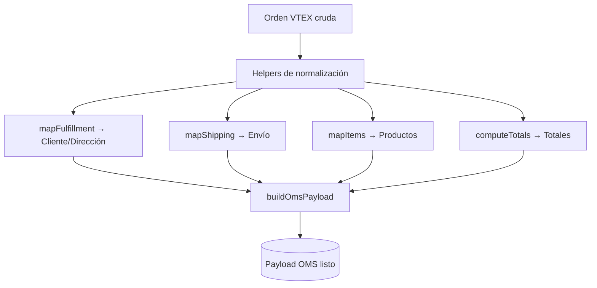

### OMS Mapper — `services/omsMapper.js`

Este módulo contiene **funciones de ayuda y normalización** para transformar los datos de una orden proveniente de **VTEX** en un formato estándar que el **OMS interno** pueda entender.

---

## 🌐 Explicación no técnica

Cuando llega una orden desde VTEX, los datos vienen con estructuras y nombres que no siempre son los mismos que usa nuestro sistema interno (**OMS**).  
Este archivo actúa como un **traductor** que:

- 📦 Convierte los productos de VTEX al formato esperado por OMS.  
- 🏠 Normaliza la dirección, teléfono y datos de cliente.  
- 🚚 Interpreta tiempos y formas de entrega.  
- 🧾 Calcula totales de la orden.  

En simple: **toma una orden de VTEX y la deja lista para que el OMS pueda procesarla sin errores**.

---

## ⚙️ Explicación técnica

### Helpers principales

- **`pick(obj, path, dflt)`** → Extrae un campo anidado de un objeto sin lanzar error si falta.  
- **`normalizePhone(p)`** → Limpia y normaliza un número de teléfono.  
- **`computeTotals(vtex)`** → Calcula el valor total de la orden.  
- **`mapFulfillment(vtex)`** → Extrae y transforma la información del cliente y dirección.  
- **`mapShipping(vtex)`** → Obtiene datos del envío (SLA, courier, fecha estimada).  
- **`normalizeCategoryPath(raw)`** → Limpia y estandariza la cadena de categorías.  
- **`mapItems(vtex)`** → Convierte los ítems del carrito de VTEX al formato esperado por OMS.  
- **`buildOmsPayload(vtex, { orderId })`** → Ensambla el payload final para enviar al OMS.

---

## 📄 Firma de la función principal

```ts
buildOmsPayload(
  vtex: object,
  options: { orderId: string }
): {
  salesChannelReferenceId: string,
  u_ref1: string,
  orderStatusCode: string,
  doctotalsy: number | null,
  valuesInCents: boolean,
  deliveryDate: string | null,
  origin: string,
  hostname: string,
  shippingEstimate: string | null,
  deliveryCompany: string | null,
  fulfillment: object,
  items: object[]
}
```

---

## 🚀 Ejemplo de uso

```js
const { buildOmsPayload } = require('./services/omsMapper');

const payload = buildOmsPayload(vtexOrder, { orderId: '1561909550561-01' });

console.log(payload);
```

📋 **Resultado esperado**:  
Un objeto listo para insertarse en el OMS:

```json
{
  "salesChannelReferenceId": "VTEX-001",
  "u_ref1": "1561909550561-01",
  "orderStatusCode": "ready-for-handling",
  "doctotalsy": 152900,
  "valuesInCents": true,
  "deliveryDate": "2025-09-12T15:30:00Z",
  "origin": "VTEX",
  "hostname": "mimbralb2c",
  "shippingEstimate": "2bd",
  "deliveryCompany": "Chilexpress",
  "fulfillment": {
    "firstName": "Javiera",
    "lastName": "Saavedra",
    "email": "csaavedra@mimbral.cl",
    "phone": "+56962070906",
    "isCorporate": false,
    "currencyCode": "CLP",
    "documentType": "RUT",
    "document": "20007759-8",
    "receiverName": "Javiera Saavedra",
    "street": "39 Oriente",
    "number": "1163",
    "city": "Talca",
    "state": "Maule",
    "country": "CL",
    "postalCode": "3460000",
    "giro": "PARTICULAR",
    "cardname": "Javiera Saavedra"
  },
  "items": [
    {
      "itemIndex": 0,
      "uniqueId": "SKU123-1",
      "itemcode": "123",
      "dscription": "Taladro Bosch 500W",
      "quantity": 1,
      "priceAfterVAT": 52900,
      "codebars": "7891234567890",
      "imageUrl": "https://mimbral.cl/images/sku123.jpg",
      "categoryLeafId": 100,
      "categoryLeafName": "Herramientas Eléctricas",
      "categoryPathIds": "/100/200/",
      "categoryPathNames": "Ferretería > Herramientas"
    }
  ]
}
```

---

## 📊 Flujo simplificado



---

## ✅ Buenas prácticas

- **Totales**: Siempre confirmar que `valuesInCents = true` si VTEX devuelve valores en centavos.  
- **Documentos**: Para empresas usar `corporateDocument`; para personas `document`.  
- **Direcciones**: Validar campos nulos (`street`, `number`, `postalCode`).  
- **Items**: Versionar categorías (`categoryPathIds` y `categoryPathNames`) para análisis posteriores.  
- **Logs**: Registrar payloads parciales en modo debug para facilitar trazabilidad.  

---