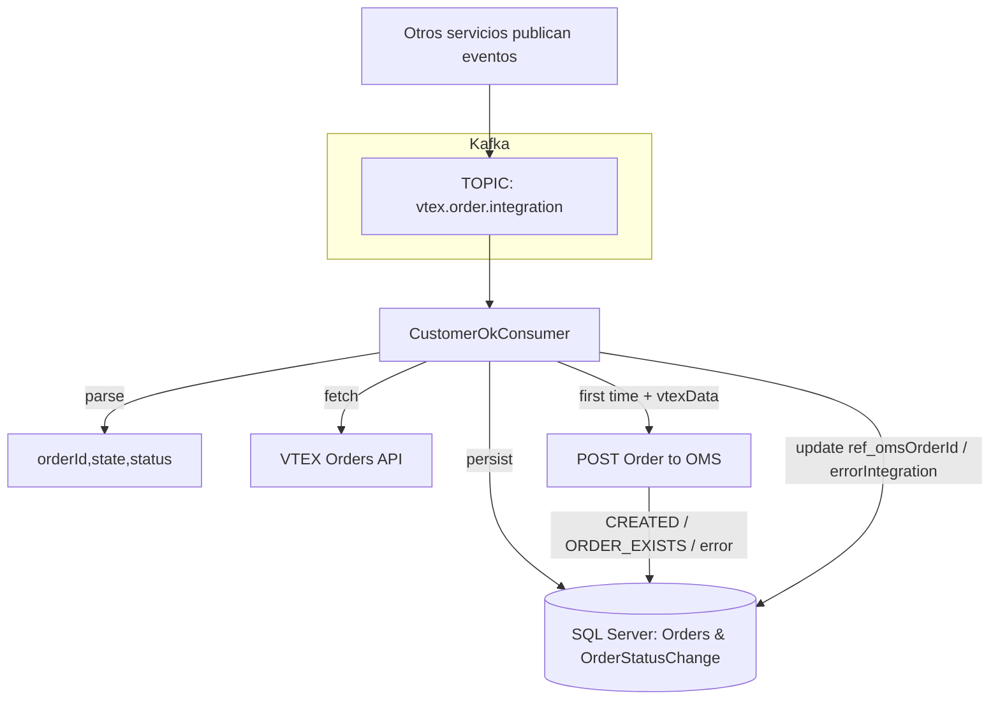

### Kafka Consumer — `src/utils/kafka/consumers/CustomerOkConsumer.js`

Este módulo implementa un **consumidor de Kafka** que recibe eventos de VTEX/OMS, **persiste** la orden y su estado en la base de datos, y en la **creación inicial** hace **POST al OMS** con el payload construido a partir del detalle de la orden en VTEX.

---

## 🌍 Explicación no técnica

Piensa en este archivo como un **operador** que:
1. 📥 **Escucha** el buzón (tópico de Kafka) donde llegan mensajes con cambios de estado de pedidos.
2. 🗂️ **Guarda** el pedido en la base si aún no existe y registra su primer estado.
3. 🔎 **Pide a VTEX** la ficha completa del pedido.
4. 📤 **Envía** la orden al OMS (solo la primera vez) con los datos en el formato correcto.
5. 🧾 **Actualiza** la orden con el `ref_omsOrderId` o registra un error de integración si falló.

---

## ⚙️ Explicación técnica

### Entradas/Dependencias
- **KafkaJS** (`kafkajs`): conexión al clúster (brokers por `KAFKA_BROKER`).
- **DB (mssql)**: `IdServicePool`, `IdServicePoolConnect`, `sql` desde `config/dbnew`.
- **Servicios VTEX/OMS**:
  - `fetchVtexOrder(orderId)`: trae detalle de orden desde VTEX.
  - `buildOmsPayload(vtexOrder)`: transforma VTEX → OMS.
  - `postOrderToOms(payload)`: POST al OMS.

### Variables de entorno
- `KAFKA_BROKER=kafka1:9092,kafka2:9092`
- `KAFKA_CLIENT_ID=orders-vtex-consumer`
- `KAFKA_GROUP_ORDERS=orders-ms`
- `KAFKA_TOPIC_ORDER_STATUS=vtex.order.integration`

---

## 🧠 Principales funciones

```ts
startCustomerOkConsumer(): Promise<Consumer>
```
Crea el cliente Kafka, se suscribe al `TOPIC` y ejecuta `eachMessage` para cada registro recibido.

```ts
handleVtexOrderMessage(message: KafkaMessage, ctx: { topic: string, partition: number, offset: string }): Promise<void>
```
Procesa **un** mensaje:
1. `parseOrderMessage()` extrae `orderId`, `state`, `status` desde **value** y **headers**.
2. `fetchVtexOrder(orderId)` (try/catch; continúa aunque falle).
3. `persistOrderAndStatus({...})` (transacción con **UPDLOCK/HOLDLOCK**):
   - Si existe la orden → **omite** POST al OMS.
   - Si no existe → **inserta** en `Orders` y registra estado inicial en `OrderStatusChange`.
4. Si se **creó** y hay detalle de VTEX:
   - `buildOmsPayload(vtexData, { orderId, state, status })`
   - `postOrderToOms(payload)` → `extractOmsOrderOutcome(resp)`
   - `updateOrderWithOmsId(orderPkId, outcome.id)` y limpia `errorIntegration`
   - Si `ORDER_EXISTS` → setea `errorIntegration='ORDER_EXISTS'` (y opcionalmente `ref_omsOrderId`)
   - Otros casos → persiste `errorIntegration` con el mensaje
5. Errores en POST → `normalizeOmsError(e)` y `setOrderErrorIntegration(orderPkId, code)`.

```ts
parseOrderMessage(message: KafkaMessage): { orderId: string, state: string, status: string, payload: any, headers: Record<string,string> }
```
Tolera variantes de claves (`orderId/OrderId/ORDERID` y `state/status` en body o headers). Valida tipos y lanza errores explícitos.

```ts
persistOrderAndStatus(input): Promise<{ orderPkId: number, created: boolean }>
```
Transacción:
- Busca por `commerceId` con lock.
- Si no existe, inserta en `Orders` y primer estado en `OrderStatusChange`.
- Devuelve `created=true` solo en la primera inserción.

```ts
normalizeOmsError(e): string
```
Convierte errores HTTP/red a códigos **conocidos**: `ORDER_EXISTS`, `STATUS_NOT_FOUND`, `OMS_UNREACHABLE`, `OMS_TIMEOUT`, etc.

---

## 🚀 Ejemplo de arranque

```js
// index.js (bootstrap del microservicio)
require('dotenv').config();
const { startCustomerOkConsumer } = require('./utils/kafka/consumers/CustomerOkConsumer');

(async () => {
  try {
    await startCustomerOkConsumer();
    console.log('🟢 Consumer iniciado');
  } catch (e) {
    console.error('🔴 No se pudo iniciar el consumer:', e.message);
    process.exit(1);
  }
})();
```

---

## 📊 Flujo simplificado



---

## ✅ Buenas prácticas

| Área              | Recomendación                                                                 |
|-------------------|-------------------------------------------------------------------------------|
| **Idempotencia**  | Insertar orden solo si no existe (lock + búsqueda por `commerceId`).         |
| **Orden de eventos** | Consumir con `groupId` estable; usa `key=orderId` en el productor.        |
| **Tolerancia a fallos** | Continuar el flujo de persistencia aunque falle `fetchVtexOrder`.      |
| **Errores OMS**   | Normalizar y registrar `errorIntegration` con un código claro.                |
| **Logs**          | Incluir `topic|partition|offset` y `orderId`. Evitar datos sensibles.         |
| **Timeouts**      | Manejar tiempos en VTEX/OMS y reintentos donde corresponda.                   |

---

## 🛑 Errores frecuentes

- **KAFKA_BROKER no definido** → El consumer no puede iniciar (lanza error explícito).  
- **VTEX_MSG_INVALID_ORDERID / STATE** → El mensaje del tópico no trae campos mínimos.  
- **Conflictos de inserción** → Resuelto por transacción + `UPDLOCK/HOLDLOCK`.  
- **OMS_UNREACHABLE / OMS_TIMEOUT** → Problemas de red/timeout al POST; quedan en `errorIntegration`.  

---

## 🔧 Tablas esperadas (nombres usados en queries)

- `dbo.Orders`  
  - Campos relevantes: `id`, `commerceId`, `ref_omsOrderId`, `creationDate`, `source`, `insertedAt`, `updatedAt`, `statusIntegration`, `errorIntegration`.
- `dbo.OrderStatusChange`  
  - Campos: `orderId`, `source`, `state`, `status`, `dateCreated`, `dateModified`.

---

## 🔎 Pseudocódigo

```text
startCustomerOkConsumer():
  validar BROKERS
  crear Kafka(clientId, brokers) y consumer(groupId)
  connect + subscribe(topic)
  run(eachMessage):
    try handleVtexOrderMessage(message, ctx)
    catch log error con offset y preview de value
  on SIGINT/SIGTERM: disconnect y exit

handleVtexOrderMessage(message, ctx):
  { orderId, state, status } = parseOrderMessage(message)
  vtexData = try fetchVtexOrder(orderId) catch null
  { orderPkId, created } = persistOrderAndStatus({ commerceId: orderId, creationDateIso: vtexData?.creationDate, state, status })
  si !created → log y return
  si !vtexData → log y return
  payload = buildOmsPayload(vtexData, { orderId, state, status })
  resp = postOrderToOms(payload)
  outcome = extractOmsOrderOutcome(resp)
  si CREATED → updateOrderWithOmsId + clear errorIntegration
  si ORDER_EXISTS → set errorIntegration='ORDER_EXISTS' (+ opcional ref_omsOrderId)
  otro → set errorIntegration=mensaje
  catch e → set errorIntegration = normalizeOmsError(e)
```