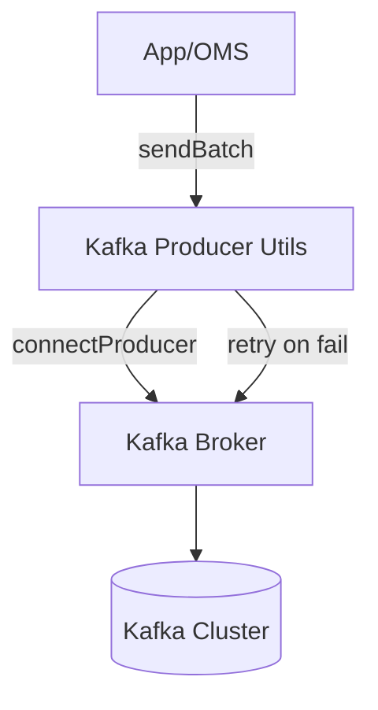

### Kafka Producer Utils — `src/utils/kafkaProducer.js`

Este módulo implementa la **lógica central de conexión y envío de mensajes a Kafka**.  
Es utilizado por otros módulos (como `producer/index.js`) para garantizar que los mensajes se envíen de manera confiable, incluso cuando ocurren errores temporales en el clúster Kafka.

---

## 🌍 Explicación no técnica

Imagina que este archivo es como un **telégrafo robusto**:  
- 📡 Se conecta una sola vez al servidor de Kafka.  
- ✉️ Envía mensajes empaquetados (pueden ir comprimidos).  
- 🔁 Si falla, lo intenta varias veces con pausas crecientes (reintentos).  
- ✅ Solo deja de intentar cuando ya no es posible o logra enviar el mensaje.  

De esta forma, el sistema evita perder pedidos por caídas momentáneas de Kafka.

---

## ⚙️ Explicación técnica

### Funciones principales

```ts
connectProducer(): Promise<Producer>
```
- Crea una única conexión al **Kafka Producer** (singleton).
- Marca el estado como conectado (`isConnected = true`) para no repetir conexiones.
- Devuelve el productor listo para enviar.

```ts
sendBatch(topic: string, messages: Array<{ key?: string, value: string, headers?: Record<string,string|Buffer> }>): Promise<void>
```
- Envía un lote de mensajes a un `topic` en Kafka.
- Usa compresión `GZIP` para optimizar la transmisión.
- Implementa **reintentos exponenciales** (hasta 6 intentos, máximo 10s entre cada uno).
- Considera ciertos errores como “retriables” (`LEADER_NOT_AVAILABLE`, `REQUEST_TIMED_OUT`, etc.).

---

## 🚀 Ejemplo de uso

```js
const { sendBatch } = require('../utils/kafkaProducer');

const messages = [
  { key: '1561909550561-01', value: JSON.stringify({ orderId: '1561909550561-01', status: 'created' }) }
];

await sendBatch('vtex.orderIntegration', messages);
```

📋 **Resultado esperado**:  
El mensaje se envía al tópico `vtex.orderIntegration`. Si Kafka está temporalmente inestable, el sistema reintenta hasta lograrlo o agotar los intentos.

---

## 📊 Flujo simplificado



---

## ✅ Buenas prácticas

| Área            | Recomendación                                                                 |
|-----------------|-------------------------------------------------------------------------------|
| **Conexión**    | Usar `connectProducer` siempre, evita múltiples conexiones simultáneas.       |
| **Mensajes**    | Serializar siempre con `JSON.stringify`.                                      |
| **Reintentos**  | Ajustar `MAX_ATTEMPTS` y `delay` según la criticidad del sistema.             |
| **Compresión**  | Mantener `CompressionTypes.GZIP` para eficiencia.                             |
| **Logs**        | Loguear reintentos con motivo (`msg`) para debug en producción.               |

---

## 🛑 Errores frecuentes

- ❌ **Producer not connected** → Olvidaste llamar a `connectProducer`.  
- ❌ **Unhandled retriable error** → Revisa la lista `RETRIABLE` para incluir más casos.  
- ⏳ **Timeouts constantes** → Puede indicar problemas de red o brokers saturados.  
- ⚠️ **Mensajes descartados** → Asegúrate de capturar y manejar las excepciones en el código que llama a `sendBatch`.  

---

## 🔧 Variables de entorno

Este módulo depende indirectamente de la configuración de Kafka en `config/kafka.js`, que normalmente requiere:

```env
KAFKA_BROKER=kafka:9092
KAFKA_CLIENT_ID=oms-service
```

---

## 📂 Relación con otros módulos

- **`producer/index.js`** → Usa `sendBatch` para enviar mensajes a Kafka.  
- **`oms-service`** → Depende de este módulo para garantizar confiabilidad en la mensajería.  

---

## 🔎 Pseudocódigo

```text
connectProducer():
  si no está conectado:
    producer.connect()
    marcar conectado
  devolver producer

sendBatch(topic, messages):
  intentar hasta 6 veces:
    enviar mensajes con GZIP
    si éxito → terminar
    si error retriable → esperar delay exponencial y reintentar
  si falla en todos los intentos → lanzar último error
```